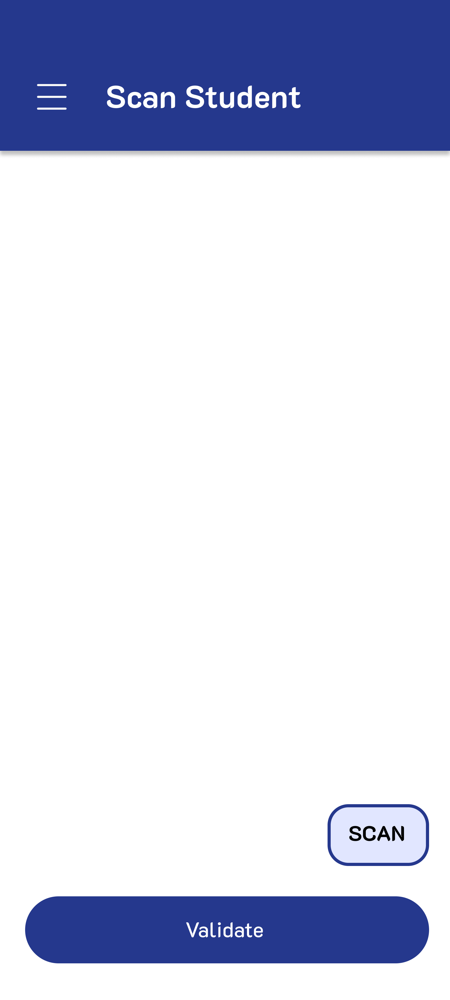

# Bluetooth Attendance Management System

A mobile application that allows teachers to efficiently manage student attendance using Bluetooth technology. This app enables teachers to view student details, mark attendance, view past attendance data, and generate daily attendance reports in PDF format.

## Features

- **Student Profiles**: View detailed student profiles.
- **Bluetooth Attendance Marking**: Mark attendance quickly and accurately via Bluetooth detection.
- **Attendance History**: Access past attendance records for each student.
- **PDF Reports**: Generate daily attendance reports in PDF format for easy sharing and record-keeping.
- **User-Friendly Interface**: Intuitive design for easy navigation and management.

## Technologies Used

- **Flutter**: For building the cross-platform mobile application.
- **Firebase**: For backend services including real-time database, authentication, and storage.

## Screenshots

| Output Images                                   |
|------------------------------------------------|
|    |
|   |

